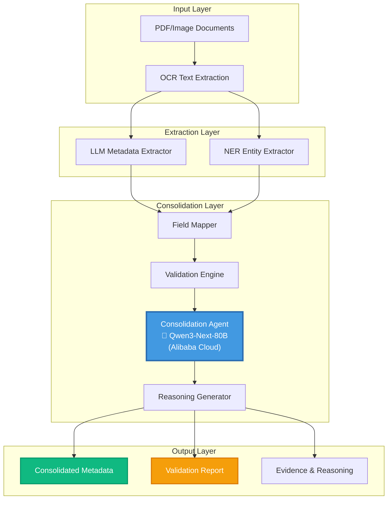
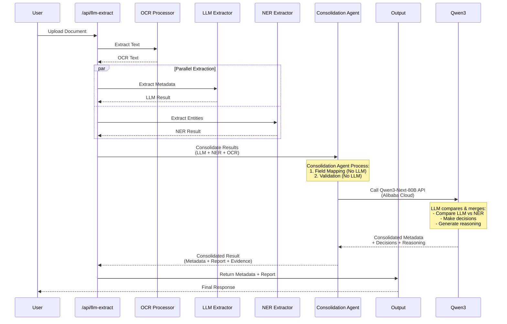
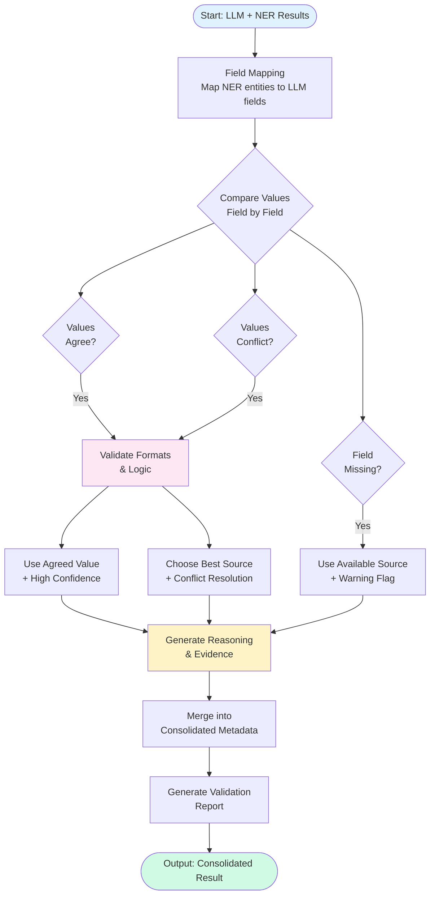
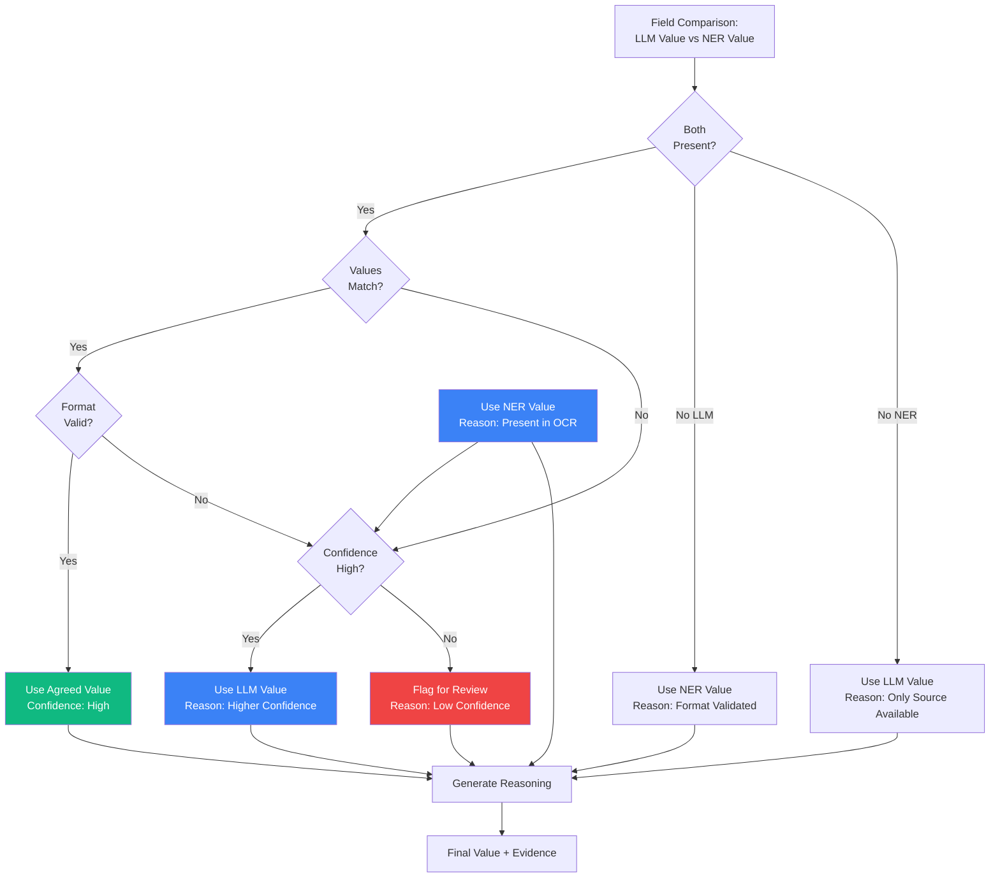
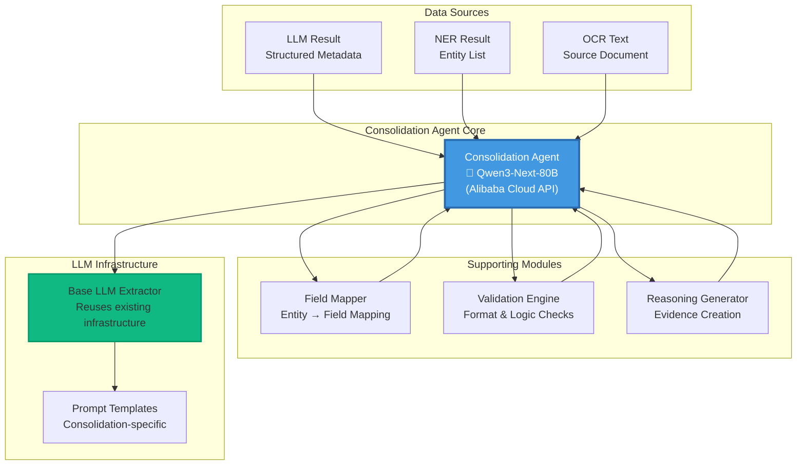
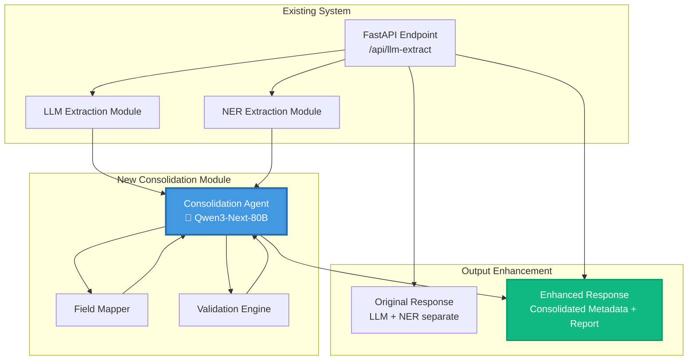
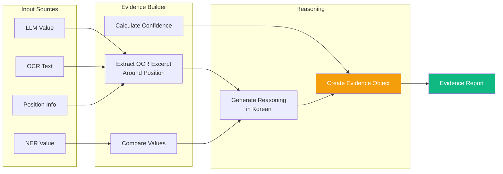
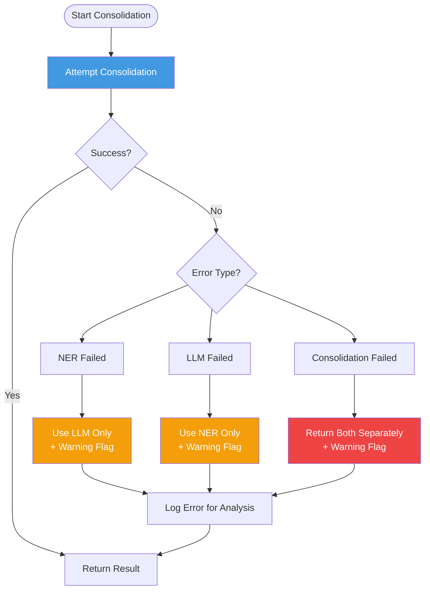
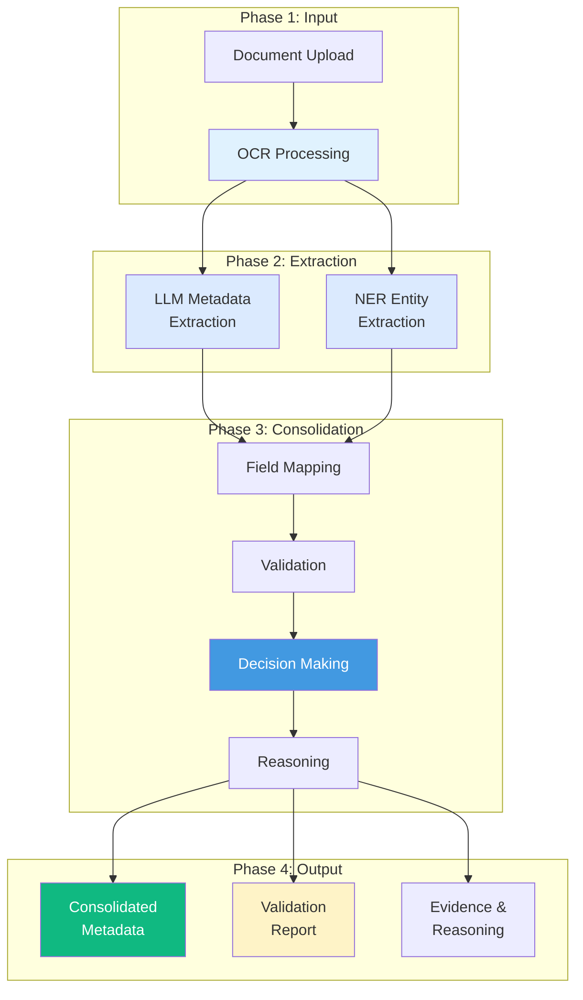

# Metadata Consolidation System - Architecture Diagrams

## 1. System Architecture Overview



## 2. Data Flow Diagram



## 3. Consolidation Process Flow



## 4. Field Mapping Strategy

```mermaid
graph LR
    subgraph "NER Entities"
        NER_NAME[NAME: 집건에]
        NER_DATE[DATE: 2024-01-15]
        NER_PHONE[PHONE: 010-1234-5678]
        NER_COMPANY[COMPANY: 국립생태원]
    end
    
    subgraph "Mapping Logic"
        MAPPER[Field Mapper<br/>Context-aware Matching]
    end
    
    subgraph "LLM Fields"
        LLM_RIGHTS[rights_holder]
        LLM_USER[user]
        LLM_DATE[signature_date]
        LLM_PHONE[parties[].phone]
    end
    
    NER_NAME --> MAPPER
    NER_DATE --> MAPPER
    NER_PHONE --> MAPPER
    NER_COMPANY --> MAPPER
    
    MAPPER -->|Match by position| LLM_RIGHTS
    MAPPER -->|Match by position| LLM_USER
    MAPPER -->|Match by format| LLM_DATE
    MAPPER -->|Match by pattern| LLM_PHONE
    
    style MAPPER fill:#4299e1,color:#fff
```

## 5. Decision Logic Flow



## 6. Component Interaction



## 7. Integration with Existing System



## 8. Evidence Generation Process



## 9. Error Handling & Fallback



## 10. Complete System Pipeline



## How to Use These Diagrams

1. **For Presentations**: Copy the Mermaid code to [Mermaid Live Editor](https://mermaid.live/) or use in PowerPoint with a Mermaid plugin
2. **For Documentation**: Include directly in Markdown files (GitHub, GitLab support Mermaid)
3. **For Printing**: Export as PNG/SVG from Mermaid Live Editor
4. **Alternative**: Convert to draw.io format if needed

## Diagram Legend

- **Blue**: Core processing components
- **Green**: Output/results
- **Yellow**: Validation/warning states
- **Red**: Error/fallback scenarios
- **Purple**: Supporting infrastructure

