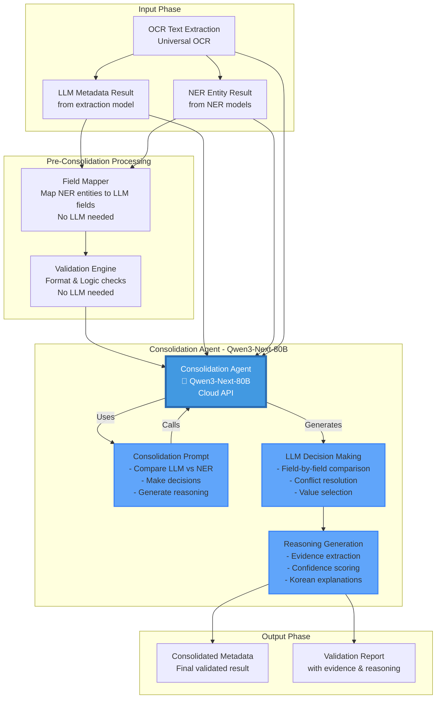

# Qwen3-Next-80B in Consolidation Flow

## Where Qwen3-Next-80B is Used

The **Qwen3-Next-80B** model (via Alibaba Cloud API: `alibaba-qwen3-next-80b-a3b-instruct`) is used as the **Consolidation Agent** - the intelligent LLM expert that compares, validates, and merges results from both LLM extraction and NER extraction.

## Detailed Flow Diagram



## Step-by-Step Flow with Qwen3-Next-80B

```
STEP 1: DATA PREPARATION (No LLM)
═══════════════════════════════════════════════════════════════
Input:
├─ LLM Result: {metadata: {...}, confidence: 0.95}
├─ NER Result: {entities: [...], statistics: {...}}
└─ OCR Text: "저작재산권 비독점적 이용허락 계약서..."

Processing:
├─ Field Mapper: Maps NER entities to LLM fields
│  └─ Example: NER "집건에" (NAME) → LLM "rights_holder"
│
└─ Validation Engine: Validates formats/logic
   └─ Example: Date format check, phone pattern validation


STEP 2: CONSOLIDATION AGENT - Qwen3-Next-80B 🤖
═══════════════════════════════════════════════════════════════

This is where Qwen3-Next-80B is invoked:

Consolidation Agent:
┌─────────────────────────────────────────────────────────────┐
│                                                             │
│  Prompt to Qwen3-Next-80B:                                │
│  ──────────────────────────────────────────────────────── │
│  당신은 한국어 문서 메타데이터 추출 전문가입니다.          │
│                                                             │
│  OCR 텍스트:                                                │
│  [Full OCR text]                                            │
│                                                             │
│  LLM 추출 결과:                                              │
│  {                                                           │
│    "rights_holder": "집건에",                               │
│    "signature_date": "2024-01-15",                          │
│    ...                                                       │
│  }                                                           │
│                                                             │
│  NER 추출 결과:                                              │
│  [                                                           │
│    ("집건에", "NAME"),                                      │
│    ("2024-01-15", "DATE"),                                 │
│    ...                                                       │
│  ]                                                           │
│                                                             │
│  작업:                                                       │
│  1. 각 필드를 비교하여 일치/불일치 판단                      │
│  2. 더 신뢰할 수 있는 값 선택                                │
│  3. 선택 이유를 한국어로 설명                               │
│  4. 최종 통합 메타데이터 생성                                │
│                                                             │
│  출력 형식 (JSON만):                                        │
│  {                                                           │
│    "consolidated_metadata": {...},                         │
│    "decisions": [{                                          │
│      "field": "signature_date",                            │
│      "llm_value": "2024-01-15",                            │
│      "ner_value": "2024-01-15",                            │
│      "final_value": "2024-01-15",                          │
│      "decision": "AGREED",                                 │
│      "reasoning": "Both sources extracted...",              │
│      "confidence": 1.0                                    │
│    }]                                                       │
│  }                                                           │
│                                                             │
└─────────────────────────────────────────────────────────────┘
         │
         │ API Call to Alibaba Cloud
         ▼
┌─────────────────────────────────────────────────────────────┐
│  Alibaba Cloud API                                          │
│  Model: qwen3-next-80b-a3b-instruct                        │
│  Endpoint: https://dashscope.aliyuncs.com/...              │
│  Region: Singapore                                          │
└─────────────────────────────────────────────────────────────┘
         │
         │ Response
         ▼
┌─────────────────────────────────────────────────────────────┐
│  Qwen3-Next-80B Response:                                  │
│  {                                                           │
│    "consolidated_metadata": {...},                         │
│    "decisions": [...],                                     │
│    "reasoning": "..."                                       │
│  }                                                           │
└─────────────────────────────────────────────────────────────┘


STEP 3: POST-PROCESSING (No LLM)
═══════════════════════════════════════════════════════════════
Processing:
├─ Parse Qwen3-Next-80B response
├─ Generate evidence objects
├─ Calculate final confidence scores
└─ Format validation report


STEP 4: OUTPUT
═══════════════════════════════════════════════════════════════
Output:
├─ Consolidated Metadata (final validated result)
├─ Validation Report (with evidence)
└─ Evidence & Reasoning (for audit trail)
```

## Qwen3-Next-80B Specific Configuration

```python
# In consolidation_agent.py

class ConsolidationAgent:
    def __init__(self, model_name="alibaba-qwen3-next-80b-a3b-instruct"):
        """
        Initialize consolidation agent with Qwen3-Next-80B
        
        Model: alibaba-qwen3-next-80b-a3b-instruct
        Provider: Alibaba Cloud (DashScope API)
        Region: Singapore
        """
        self.model_name = model_name
        self.llm_extractor = LLMExtractionProcessor()
        self.llm_extractor.initialize_model(model_name)
        
    def consolidate(self, llm_result, ner_result, ocr_text, document_type):
        """
        Main consolidation method using Qwen3-Next-80B
        
        Flow:
        1. Prepare prompt with LLM + NER results
        2. Call Qwen3-Next-80B via Alibaba Cloud API
        3. Parse response and generate evidence
        """
        # Create consolidation prompt
        prompt = self._create_consolidation_prompt(
            llm_result, ner_result, ocr_text, document_type
        )
        
        # Call Qwen3-Next-80B
        response = self.llm_extractor.extractor.extract_metadata(
            text=prompt,
            schema=self._get_consolidation_schema(),
            document_type=document_type
        )
        
        # Parse and return consolidated result
        return self._parse_consolidation_response(response)
```

## Comparison: Extraction vs Consolidation Models

```
┌─────────────────────────────────────────────────────────────┐
│              MODEL USAGE COMPARISON                          │
└─────────────────────────────────────────────────────────────┘

EXTRACTION PHASE:
───────────────────────────────────────────────────────────────
Model: User's choice (SOLAR-Ko, Qwen, etc.)
Purpose: Extract metadata from OCR text
Input: OCR text + document schema
Output: Structured metadata (JSON)

CONSOLIDATION PHASE:
───────────────────────────────────────────────────────────────
Model: Qwen3-Next-80B (Fixed choice)
Purpose: Compare & merge LLM + NER results
Input: LLM metadata + NER entities + OCR text
Output: Consolidated metadata + reasoning

KEY DIFFERENCE:
───────────────────────────────────────────────────────────────
• Extraction: Can use any model (user configurable)
• Consolidation: Always uses Qwen3-Next-80B (fixed for quality)
```

## Why Qwen3-Next-80B for Consolidation?

```
ADVANTAGES:
═══════════════════════════════════════════════════════════════

1. HIGH PERFORMANCE
   • 80B parameters → Excellent reasoning capability
   • Latest Qwen3 generation → State-of-the-art performance

2. CLOUD-BASED
   • No local GPU requirements
   • Fast inference via API
   • Scalable for production

3. KOREAN LANGUAGE SUPPORT
   • Strong Korean understanding
   • Can generate Korean reasoning explanations
   • Handles Korean document structures well

4. CONSISTENT QUALITY
   • Fixed model ensures consistent consolidation logic
   • Not dependent on user's extraction model choice
   • Dedicated to consolidation task (specialized)

5. COST-EFFECTIVE
   • Only used once per document (consolidation step)
   • Pay-per-use cloud pricing
   • No infrastructure setup needed
```

## API Integration Points

```python
# In app.py /api/llm-extract endpoint

@app.post("/api/llm-extract")
async def llm_extract_metadata(...):
    # Step 1: OCR (no LLM)
    ocr_result = processor.process_single_file(...)
    
    # Step 2: LLM Extraction (user's chosen model)
    llm_result = llm_processor.extract_metadata_from_text(
        text=ocr_text,
        model_name=model_name  # ← User's choice (e.g., "solar-ko")
    )
    
    # Step 3: NER Extraction (NER models)
    ner_result = ner_predict(...)
    
    # Step 4: Consolidation (Qwen3-Next-80B) ← HERE
    from module.consolidator import ConsolidationAgent
    
    # Initialize with Qwen3-Next-80B
    agent = ConsolidationAgent(
        model_name="alibaba-qwen3-next-80b-a3b-instruct"  # ← Fixed
    )
    
    # Call consolidation
    consolidated = agent.consolidate(
        llm_result=llm_result,
        ner_result=ner_result,
        ocr_text=ocr_text,
        document_type=document_type
    )
    
    # Return consolidated result
    return {
        "metadata": consolidated.consolidated_metadata,
        "validation_report": consolidated.validation_report,
        ...
    }
```

## Model Availability Check

The Qwen3-Next-80B model is already configured in your system:

✅ **Model ID**: `alibaba-qwen3-next-80b-a3b-instruct`
✅ **Provider**: Alibaba Cloud (DashScope)
✅ **API Key**: Uses `DASHSCOPE_API_KEY` environment variable
✅ **Status**: Already in model configs (line 72 in llm_extractor.py)

## Environment Setup

```bash
# Required environment variable
export DASHSCOPE_API_KEY="your_alibaba_api_key_here"

# Or in .env file
DASHSCOPE_API_KEY=your_alibaba_api_key_here
```

## Complete Flow with Model Names

```
Document Upload
    │
    ▼
OCR Processing (Google/Mistral/Alibaba OCR)
    │
    ├─────────────────────────────┐
    │                             │
    ▼                             ▼
LLM Extraction              NER Extraction
Model: User Choice          Model: klue-roberta-large
(e.g., solar-ko)            (or google-bert, xlm-roberta)
    │                             │
    ├──────────────┬──────────────┤
    │              │              │
    │              │              │
    ▼              ▼              ▼
┌─────────────────────────────────────┐
│   Consolidation Agent                │
│   Model: Qwen3-Next-80B              │
│   (alibaba-qwen3-next-80b-a3b-...)   │
│                                      │
│   • Compares LLM vs NER             │
│   • Makes intelligent decisions      │
│   • Generates reasoning              │
│   • Produces consolidated metadata   │
└─────────────────────────────────────┘
    │
    ▼
Final Output:
├─ Consolidated Metadata
├─ Validation Report
└─ Evidence & Reasoning
```

## Summary

**Qwen3-Next-80B is used ONLY in the Consolidation Agent step**, which happens AFTER both LLM extraction and NER extraction are complete. It acts as an "expert judge" that:

1. **Compares** the two extraction results
2. **Validates** them against each other and the source OCR
3. **Makes decisions** on which values to use
4. **Generates reasoning** for each decision
5. **Produces** the final consolidated metadata

The model is invoked via Alibaba Cloud API, requires `DASHSCOPE_API_KEY`, and is already configured in your codebase.

