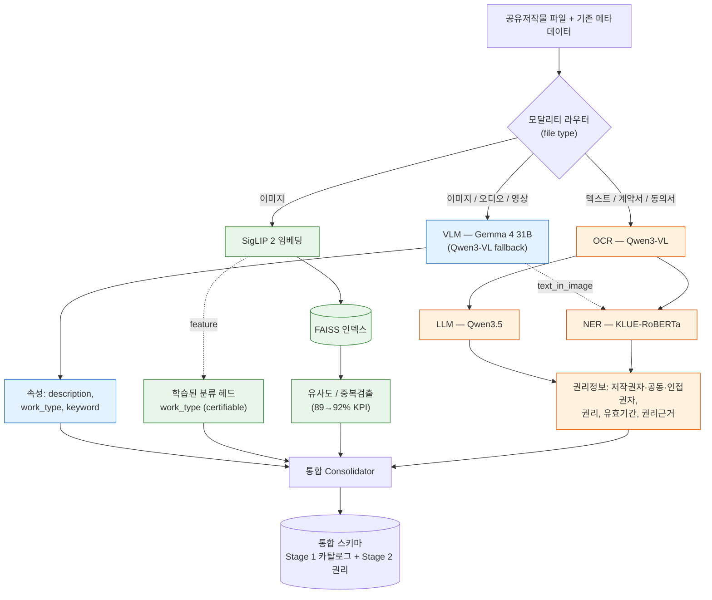
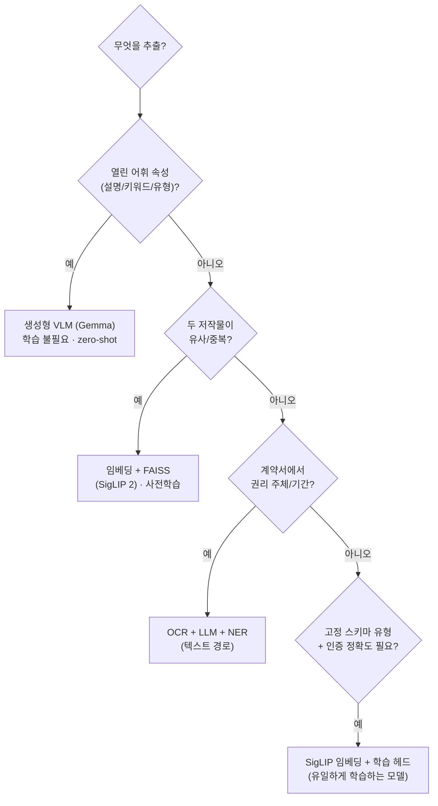
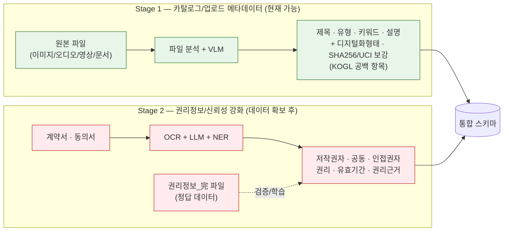
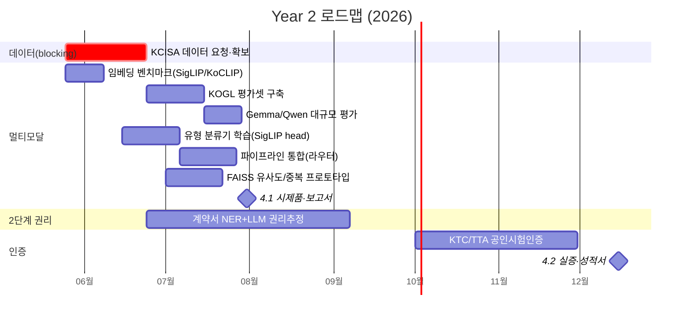

# Year 2 Multimodal Metadata Extraction — Design & Roadmap

**Owner:** 숭실대학교 산학협력단 (Soongsil) · **Project:** AI 기반 공유저작물 분석 및 유형 판단 시스템 (문체부/콘진원 R&D)
**Stage 2 period:** 2026.01 – 2026.12 · **Last updated:** 2026-05-24

---

## 요약 (Executive summary, KR)

1단계에서 구축한 **계약서·동의서 메타데이터 추출 파이프라인**(OCR→LLM→NER→통합, 20개 요소 통합 스키마)에, 2단계 목표인 **이미지·텍스트 멀티모달 분석**을 추가한다. 핵심 결론:

- **속성 추출(설명·유형·키워드)은 생성형 VLM(Gemma 4 31B)으로 zero-shot 처리** — 별도 학습 불필요. CLIP류는 "매체(medium)" 기준 유형 분류에 부적합함을 실증.
- **유사도·중복검출은 SigLIP 2 임베딩 + FAISS** — 사전학습 임베딩 사용, CLIP류의 실제 강점.
- **NER은 텍스트/계약서 경로(2단계 권리정보)로 역할 이동** — 이미지에는 VLM이, 텍스트·계약서에는 OCR+LLM+NER이 동작.
- **학습이 필요한 유일한 모델: 경량 유형 분류기**(SigLIP 임베딩 + 분류 헤드, KOGL 14만 건 라벨 활용) — 공인시험인증 KPI 충족 + "AI 모델 개발" 산출물 충족용.
- 권리정보 추정 모델은 **데이터 확보 후** 학습 가능(현재 KOGL 데이터에 권리 항목 희소).

---

## 1. Scope (숭실대 Year 2 deliverables)

Per the proposal (task 4.1 / 4.2, milestones p.42):
- **4.1 (2026.01–07):** 이미지·텍스트 멀티모달 AI 분석 기술 **설계 및 구현** (CLIP 기반 메타데이터 생성기) → 연구보고서·논문·시제품
- **4.2 (2026.06–12):** 대규모 공유저작물 데이터셋 학습으로 속성 분석 **정교화 + 표준화·신뢰성 강화** → 시험성적서·실증보고서

KPIs to certify (p.34): 공유저작물 속성정보 정확도 **80→85%**, 멀티모달 저작물 속성정보 정확도 **80→85%**.

## 2. What we have (assets)

| Asset | State |
|---|---|
| 계약서/동의서 추출 파이프라인 | 운영 중 (OCR Qwen3-VL → LLM Qwen3.5 → NER KLUE-RoBERTa → 통합) |
| 통합 스키마 | 67-field / 20 필수요소 (Stage-1 정렬 완료, 운영 검증됨) |
| **KOGL 데이터 144k** | 이미지 77k·어문 33k·오디오 27k·영상 5k·3D 1.5k; 게시글URL 100%; 권리 블록 ~51% (자세히는 `project_kogl_dataset` 메모) |
| Gemma 4 31B (vLLM) | 외부 호스트, cloudflared/Tailscale 경유 접근 |
| 프로토타입 | `api/module/clip_extraction/` (CLIP 벤치마크 + `vlm/` Gemma·Qwen 비교) |

## 3. Architecture — modality router → hybrid

**Why hybrid (not CLIP-only):** CLIP-family models classify by *visual subject*, not *legal medium* (a building photo → 건축저작물, wrong). A generative VLM can be *instructed* to classify by medium and solves this. CLIP/SigLIP are retained for what they're actually good at — embedding-based similarity. See `project_vlm_comparison_verdict` memory.

**Decision logic — when to use which tool:**

## 4. Model selection

| Role | Model | Train? |
|---|---|---|
| Attribute extraction (description/work_type/keyword) | **Gemma 4 31B** (local; Qwen3-VL fallback) | No — zero-shot |
| Embedding for similarity/FAISS | **SigLIP 2** (so400m/14-384); compare KoCLIP, multilingual-CLIP, Jina | No — pretrained |
| Certifiable work_type classifier | **SigLIP embedding → linear/MLP head** | **Yes** — train on KOGL 정보유형 labels |
| Text/contract entities (rights) | **KLUE-RoBERTa NER** (existing) | Already trained; optional more-data fine-tune |
| Rights estimation (Stage 2) | LLM + NER + (future classifier) | **Later** — needs labeled rights data |

**Gemma vs Qwen:** Gemma chosen for production — local (free inference on 150k works), data stays internal, Apache-2.0, better OCR fidelity. Qwen3-VL kept as cloud fallback / burst capacity. (Strengths are complementary — on the 15-image diverse run Gemma led on photo OCR, Qwen on document/text medium classification; consider reconciling both for the `work_type` field via the existing consolidation pattern.)

**Prompt language (A/B tested 2026-06-08):** Default extraction prompt is **Korean** (`get_prompts('ko')`). We A/B-tested an English-instruction variant (`get_prompts('en')`, values still Korean) on the same 15 images: **Qwen was unaffected (0/15 work_type changes)**; **Gemma changed 5/15** but with mixed results — it nudged toward the conventional logo→도형 / text→어문 calls (the cases we deferred to the 구분 명세서), but introduced **1 JSON truncation failure** (long-document OCR overran the token budget) and **1 regression**, and ran slightly slower. **Verdict: keep Korean prompt as default.** The English variant is retained for re-test once (a) the 구분 명세서 lets us score the logo/text cases and (b) we have a bleed-prone set (this set had no language bleed in either run). Side-finding: raise `max_tokens` (1536–2048) or cap `text_in_image` length to avoid long-document truncation (prompt-independent). Reports: `vlm_compare_20260608_131551` (ko) vs `_134205` (en).

## 5. Training strategy (what to train, what not)

- **⚠️ work_type classifier on KOGL 정보유형 — NOT viable as originally planned (revised 2026-06-08):** verified that 정보유형 among image works is ~all 사진 (28,692 사진 vs 26 미술 / 41 음성) — a near-constant label, so a supervised classifier would just always predict 사진. Labels are also noisy (VLM beat them on 가례증해→어문, 만자→도형). **Options:** (a) drop it, derive work_type from file medium/MIME (no ML) — preferred; (b) silver-label distillation from the VLM (can't beat the VLM); (c) wait for richer labels via 구분 명세서. Do NOT train on raw 정보유형.
- **Rights-flag classifiers** (보호/비보호 2-class, 상업적이용허락 3-class) on the ~51% labeled subset are still trainable — but flagged questionable (rights are contract-derived, not visual; risk of spurious owner correlations) → prefer contract-based NER+LLM (Stage 2).
- **CLIP fine-tuning (proposal deliverable, p.32 "CLIP 훈련·평가·최적화") — evidence-gated:** off-the-shelf embeddings already separate true/distractor pairs cleanly and the 65% dedup miss was a data artifact (identical thumbnails), so no evidence fine-tuning is needed for dedup *yet*. Plan: build the FAISS dedup prototype with off-the-shelf multilingual-CLIP → measure on HARD near-duplicates → then fine-tune only if insufficient. Training set is assemblable NOW (144k public thumbnails + 주제어/제목 captions, ~51% filled). Run a documented fine-tune experiment regardless (image-text contrastive domain adaptation, esp. for Korean text→image retrieval) to satisfy the deliverable — a "+X% / no gain" result is valid.
- **Don't train:** open-vocabulary attribute extraction (VLM zero-shot) — training adds no value.
- **Can't train yet:** rights estimation (저작권자 provenance, 유효기간, 권리근거) — data too sparse; requires the per-agency 권리정보_完 files + contracts (see data request).

## 6. Stage 1 vs Stage 2

- **Stage 1 (catalog/upload metadata):** auto-generate from files now; even fills KOGL gaps (디지털화형태 from file ext, SHA256/UCI by hashing). Achievable with current pipeline + VLM. *(green = ready)*
- **Stage 2 (rights/신뢰성 강화):** rights from 계약서/동의서 via NER+LLM path; needs requested data. Validated against 권리정보_完 ground truth. *(red = blocked on data)*

## 7. Roadmap

| When | Milestone | Output |
|---|---|---|
| 2026-05/06 | Re-point CLIP bench → similarity/retrieval; pick embedding model (SigLIP 2 vs KoCLIP) | embedding benchmark report |
| 2026-06 | Build balanced KOGL eval set (fetch files via URL); run Gemma/Qwen at scale | accuracy numbers for KPI/cert |
| 2026-06/07 | Train work_type classifier (SigLIP head); integrate VLM path into pipeline (modality router) | trained model + integrated `clip_extraction` |
| 2026-07 | FAISS similarity/duplicate index prototype | 중복검출 prototype (with 무하유) |
| 2026-07 | **Milestone 4.1**: multimodal design+impl | 시제품, 연구보고서, 논문 |
| 2026-08+ | Stage 2 rights: NER+LLM on contracts (once data arrives); rights estimation | 권리정보 추정 |
| 2026-Q4 | KTC/TTA 공인시험인증 (속성정보·멀티모달 속성정보 정확도) | 시험성적서 |
| 2026-12 | **Milestone 4.2**: 정교화 + 신뢰성 강화 | 실증보고서, 시험성적서 |

## 8. TODO list

- [ ] **(blocking) Request data from KCISA** — original files, 권리정보_完 files, contracts, 분류표, rights rules (`docs/data_request_to_kcisa_20260524.md`)
- [ ] Re-point CLIP benchmark to similarity/retrieval; benchmark SigLIP 2 + KoCLIP for FAISS role (`embed_benchmark.py`)
- [ ] Build balanced KOGL labeled eval set (sample across 정보유형, fetch via 게시글URL)
- [ ] Run Gemma vs Qwen at scale on KOGL eval → confirm work_type + attribute accuracy
- [ ] ~~Train work_type classifier on KOGL 정보유형~~ — NOT viable (label ~all 사진); revise: derive work_type from file medium, or await richer labels (구분 명세서)
- [ ] **CLIP fine-tuning** (proposal p.32 deliverable, evidence-gated): build off-the-shelf FAISS dedup first → measure hard cases → fine-tune (image-text contrastive on KOGL thumbnails+주제어) only if needed; document the experiment regardless
- [ ] Integrate VLM + embedding path into `PipelineOrchestrator` (modality router by file type)
- [ ] Map VLM/CLIP outputs into the unified 67-field schema (work_type, keyword, description, digital_format, hash/UCI)
- [ ] Prototype FAISS similarity/duplicate index (coordinate with 무하유's 중복판별)
- [ ] NER: extend to run on VLM `text_in_image`; confirm rights-entity coverage on contracts
- [ ] Set up permanent Gemma access (Tailscale) to retire the cloudflared quick-tunnel
- [ ] Complete KTC + TTA cert forms (drafts in `docs/시험인증요청서_*_초안.md`); schedule with 유인재·유석
- [ ] Stage 2: rights estimation once data arrives (저작권자/공동/인접권자, 유효기간, 권리근거)

## 9. Risks & dependencies

- **Data access (highest):** Stage 2 + large eval blocked until KCISA provides files/rights data. → submit request before/at 5/26 meeting.
- **Gemma connectivity:** cross-network firewall blocks inbound 8001/22; currently via cloudflared quick-tunnel (temporary). → Tailscale for permanent access (`project_gemma_server_access` memo).
- **Cert timing:** KTC/TTA need product name, environment, **test data** (KOGL 1000건/유형 supplies this) — start forms early.
- **Consortium overlap:** 유사도/중복은 무하유 소관이나 멀티모달 임베딩 설계는 숭실대 — coordinate the embedding/FAISS handoff.

## 10. KPI / certification mapping

| KPI (숭실대) | Year1 → Year2 | Eval method | Cert |
|---|---|---|---|
| 공유저작물 속성정보 정확도 | 80% → 85% | 유형별 1,000건, 정확도+F1 | KTC/TTA (2차년도) |
| 멀티모달 저작물 속성정보 정확도 | 80% → 85% | 유형별 1,000건, 정확도+F1 | KTC/TTA (2차년도) |

Test data source: the KOGL 144k export (balanced sample). Test environment: GPU server.
