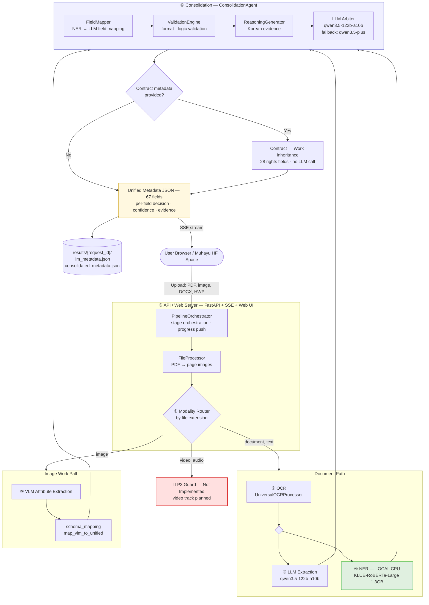
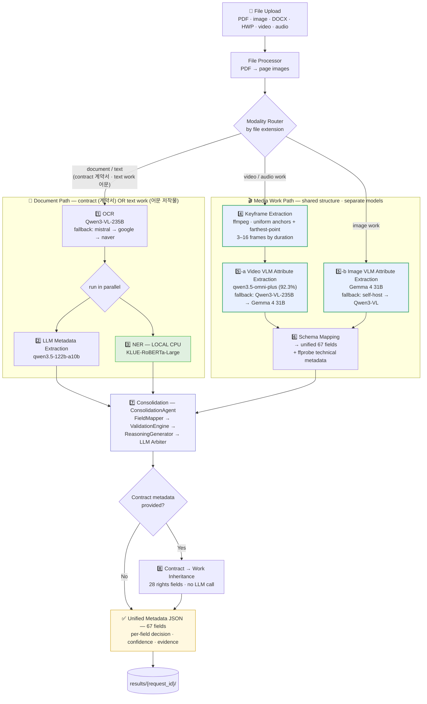
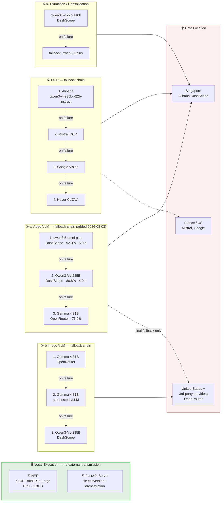
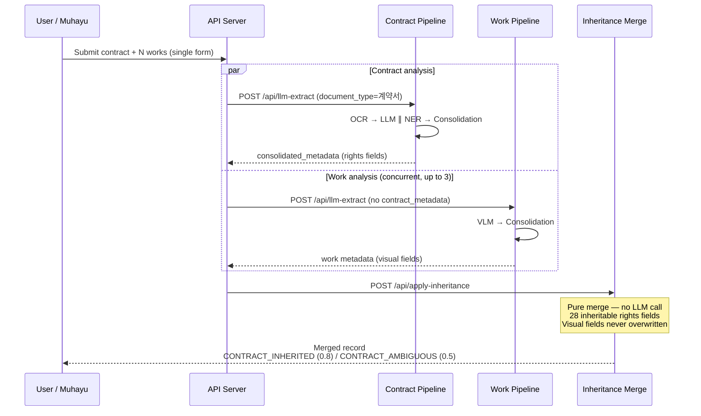
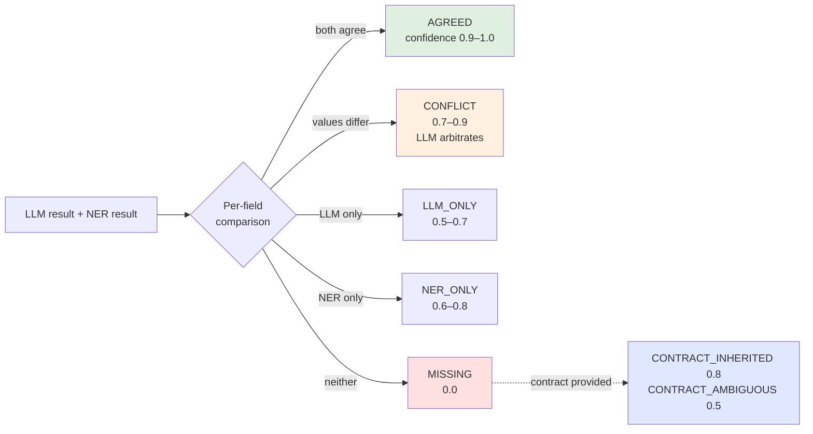

# System Pipeline Diagram

**Project** Copyright Metadata Extraction System · Soongsil University DB Lab
**Date** 2026-07-31 · **Status** As-built (current implementation)

---

## 1. Overall Pipeline

---

## 1-B. Target Pipeline — with the video track enabled

Same flow as §1, but starting at file upload and with **video/audio routed through keyframe extraction into a VLM**. Image and video **share the same processing structure** (frames → one multi-image VLM call → schema mapping) but **use different models**.

> **Updated 2026-08-03** — the first edition assumed image and video converged on one model (Gemma). An 8-model × 5-video comparison found **`qwen3.5-omni-plus` (92.3%) clearly better than Gemma (76.9%) on video**, so the models are now separate. The structure is shared and only the model differs, so the code path is reused unchanged. Evidence: `docs/video_model_comparison_report_20260803_EN.md`

**Stage reference**

| # | Stage | Runs on | Note |
|---|---|---|---|
| 1️⃣ | **OCR** | Alibaba (cloud) | Scanned document → Korean text |
| 2️⃣ | **LLM Metadata Extraction** | Alibaba (cloud) | Text → structured 67-field JSON |
| 3️⃣ | **NER** | **Local CPU** | Names, orgs, contacts — no external transmission |
| 4️⃣ | **Keyframe Extraction** | **Local (ffmpeg)** | Video only · zero API cost |
| 5️⃣-a | **Video VLM Attribute Extraction** | Alibaba (cloud) | qwen3.5-omni-plus · description, keywords |
| 5️⃣-b | **Image VLM Attribute Extraction** | OpenRouter (cloud) | Gemma 4 31B · description, work type, keywords |
| 6️⃣ | **Schema Mapping** | Local | VLM output + ffprobe → unified schema |
| 7️⃣ | **Consolidation** | Alibaba (cloud) | Arbitrates LLM vs NER, adds confidence + evidence |
| 8️⃣ | **Contract Inheritance** | **Local** | Pure merge, no LLM call |

> **Document Path serves two different roles**: a **contract/consent form (계약서·동의서)** — the rights document that *supplies* metadata — and a **text work (어문 저작물)** — a work that *receives* inherited rights. Both use the identical OCR → LLM ∥ NER → Consolidation chain; only their role in the inheritance step differs.

> **Key point**: image works go straight to the VLM; video works pass through keyframe extraction first, then enter a VLM. The two paths **share the call structure, prompt format, schema mapping and consolidation 100%** and differ **only in the model** (video `qwen3.5-omni-plus` / image Gemma 4 31B). Only the frame-extraction stage and the model routing are new.

---

## 2. Model Backends and External Dependencies

---

## 3. Paired Analysis Flow (Contract + Work)

The `/pair` endpoint analyses a contract and its works **concurrently**, then merges rights metadata once the contract completes.

---

## 4. Consolidation Decision Types

---

## 5. API Endpoints

| Endpoint | Purpose |
|---|---|
| `POST /api/llm-extract` | **Main** — full pipeline (document or image, auto-routed) |
| `POST /api/apply-inheritance` | Contract → work rights merge (no LLM call) |
| `POST /api/ocr-universal` | OCR only |
| `POST /api/ner-extract` | OCR + NER only |
| `GET /pair` | Paired inspection UI (contract + works, concurrent) |
| `GET /v2`, `GET /` | Single-file web UI |
| `GET /health` | Service status |

---

## 6. Current Status

| Component | Status |
|---|---|
| ② OCR | ✅ Operational — 4-provider fallback |
| ③ LLM extraction | ✅ Operational |
| ④ NER | ✅ Operational (local CPU, no external transmission) |
| ⑤ Image VLM | ✅ Operational — 3-tier fallback |
| ⑥ Consolidation | ✅ Operational |
| Contract inheritance | ✅ Operational — fills 19 of Muhayu's 20 work fields |
| **Video / audio track** | ❌ **Not implemented** (P3 guard) — see `video_track_implementation_plan_20260731_EN.md` |
| **RRN masking** | ❌ **Not implemented** — see `주민등록번호_마스킹_설계검토_20260731.md` |

*Korean version of this document: `docs/파이프라인_다이어그램_20260731.md`*
