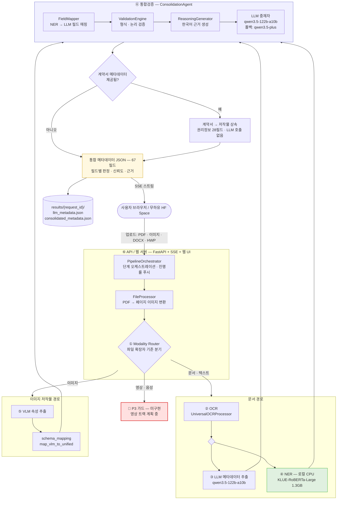
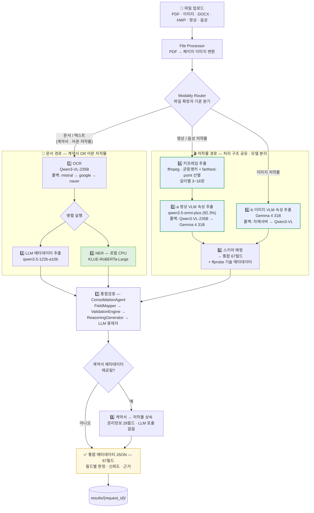
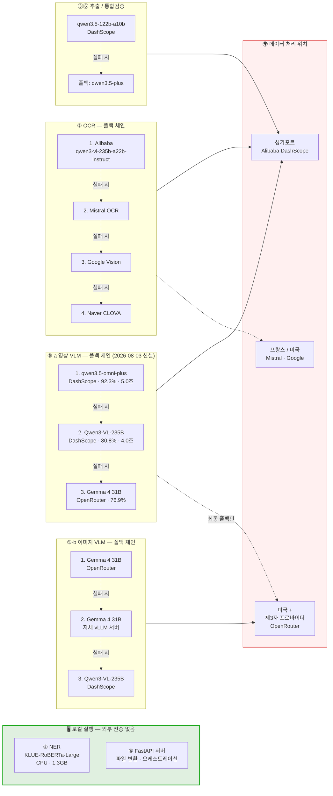
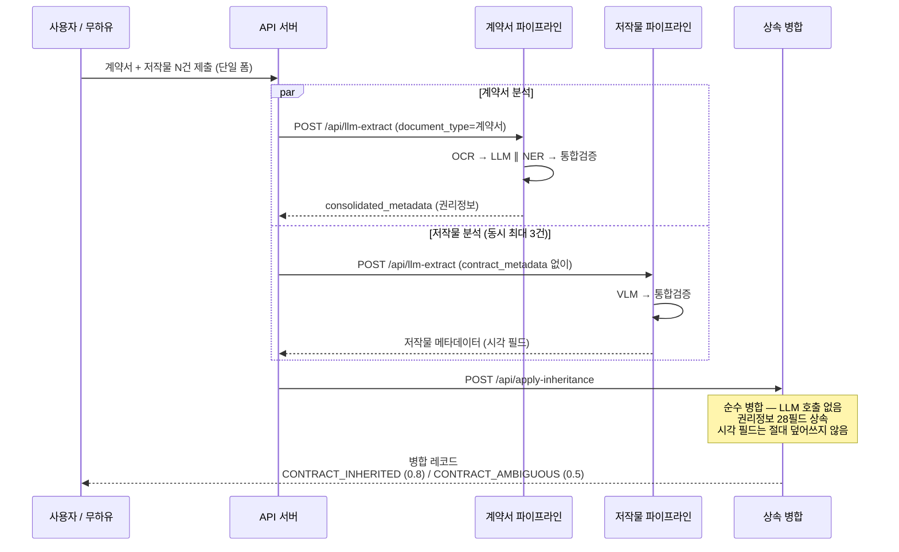
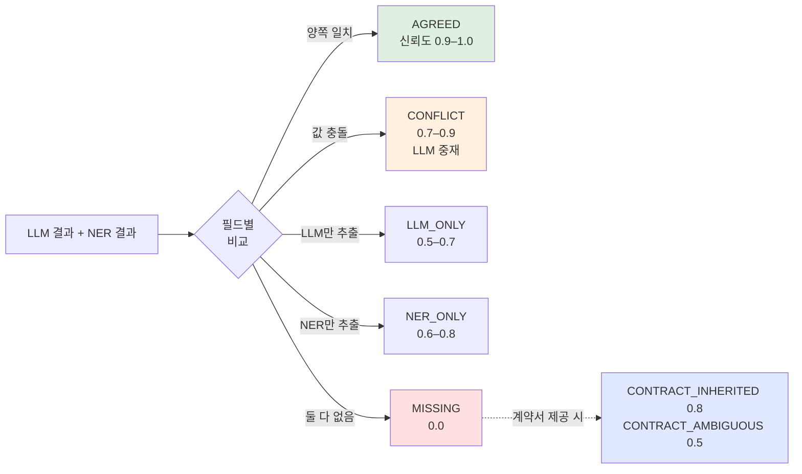

# 시스템 파이프라인 구성도

**프로젝트** 저작권 메타데이터 추출 시스템 · 숭실대학교 DB연구실
**작성일** 2026-07-31 · **기준** 현재 구현 상태(as-built)

---

## 1. 전체 파이프라인

---

## 1-B. 목표 파이프라인 — 영상 트랙 적용 시

§1과 동일한 흐름이나, **파일 업로드부터 시작**하고 **영상·음성을 키프레임 추출을 거쳐 VLM으로 라우팅**한 구성입니다. 이미지와 영상은 **동일한 처리 구조(프레임 → 다중이미지 VLM 1회 호출 → 스키마 매핑)를 공유**하되, **모델은 서로 다릅니다**.

> **2026-08-03 갱신** — 초판에서는 이미지·영상이 동일 모델(Gemma)로 수렴한다고 보았으나, 8개 모델 × 5영상 비교시험 결과 **영상은 `qwen3.5-omni-plus`(92.3%)가 Gemma(76.9%)보다 뚜렷이 우수**해 모델을 분리했습니다. 구조는 공유하고 모델만 다르므로 코드 경로는 그대로 재사용됩니다. 근거: `docs/영상모델_비교보고서_20260803.md`

**단계 설명**

| # | 단계 | 실행 위치 | 설명 |
|---|---|---|---|
| 1️⃣ | **OCR** | Alibaba (클라우드) | 스캔 문서 → 한국어 텍스트 |
| 2️⃣ | **LLM 메타데이터 추출** | Alibaba (클라우드) | 텍스트 → 구조화 67필드 JSON |
| 3️⃣ | **NER** | **로컬 CPU** | 인명·기관·연락처 — 외부 전송 없음 |
| 4️⃣ | **키프레임 추출** | **로컬 (ffmpeg)** | 영상 전용 · API 비용 0원 |
| 5️⃣-a | **영상 VLM 속성 추출** | Alibaba (클라우드) | qwen3.5-omni-plus · 설명·주제어 |
| 5️⃣-b | **이미지 VLM 속성 추출** | OpenRouter (클라우드) | Gemma 4 31B · 설명·저작물 유형·주제어 |
| 6️⃣ | **스키마 매핑** | 로컬 | VLM 출력 + ffprobe → 통합 스키마 |
| 7️⃣ | **통합검증** | Alibaba (클라우드) | LLM↔NER 중재, 신뢰도·근거 부여 |
| 8️⃣ | **계약서 상속** | **로컬** | 순수 병합, LLM 호출 없음 |

> **문서 경로는 두 가지 역할을 모두 처리합니다**: **계약서·동의서** — 권리정보를 *제공*하는 문서, 그리고 **어문 저작물** — 권리정보를 *상속받는* 저작물. 두 경우 모두 동일한 OCR → LLM ∥ NER → 통합검증 체인을 사용하며, **상속 단계에서의 역할만 다릅니다**.

> **핵심**: 이미지 저작물은 VLM으로 직행하고, 영상 저작물은 키프레임 추출을 거친 뒤 VLM으로 들어갑니다. 두 경로는 **호출 구조·프롬프트 형식·스키마 매핑·통합검증을 100% 공유**하며 **모델만 다릅니다**(영상 `qwen3.5-omni-plus` / 이미지 Gemma 4 31B). 따라서 신규 개발은 **프레임 추출 단계와 모델 라우팅뿐**입니다.

---

## 2. 모델 백엔드 및 외부 의존성

---

## 3. 계약서 + 저작물 동시 분석 흐름

`/pair` 엔드포인트는 계약서와 저작물을 **동시에** 분석한 뒤, 계약서가 완료되는 즉시 권리정보를 병합합니다.

---

## 4. 통합검증 판정 유형

---

## 5. API 엔드포인트

| 엔드포인트 | 용도 |
|---|---|
| `POST /api/llm-extract` | **메인** — 전체 파이프라인 (문서/이미지 자동 라우팅) |
| `POST /api/apply-inheritance` | 계약서 → 저작물 권리정보 병합 (LLM 호출 없음) |
| `POST /api/ocr-universal` | OCR 단독 |
| `POST /api/ner-extract` | OCR + NER 단독 |
| `GET /pair` | 계약서+저작물 동시 검사 UI |
| `GET /v2`, `GET /` | 단일 파일 웹 UI |
| `GET /health` | 서비스 상태 |

---

## 6. 현재 구현 상태

| 구성요소 | 상태 |
|---|---|
| ② OCR | ✅ 정상 — 4개 제공자 폴백 |
| ③ LLM 추출 | ✅ 정상 |
| ④ NER | ✅ 정상 (로컬 CPU, 외부 전송 없음) |
| ⑤ 이미지 VLM | ✅ 정상 — 3단 폴백 |
| ⑥ 통합검증 | ✅ 정상 |
| 계약서 상속 | ✅ 정상 — 무하유 20필드 중 19개 충족 |
| **영상 / 음성 트랙** | ❌ **미구현** (P3 가드) — `영상트랙_구현계획_20260731.md` 참조 |
| **주민등록번호 마스킹** | ❌ **미구현** — `주민등록번호_마스킹_설계검토_20260731.md` 참조 |

*English version of this document: `docs/pipeline_diagram_20260731_EN.md`*
